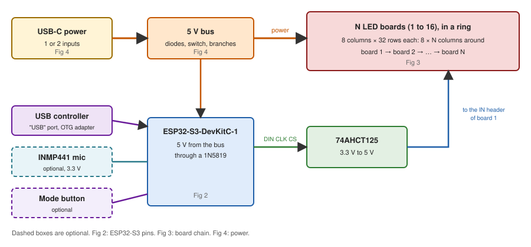
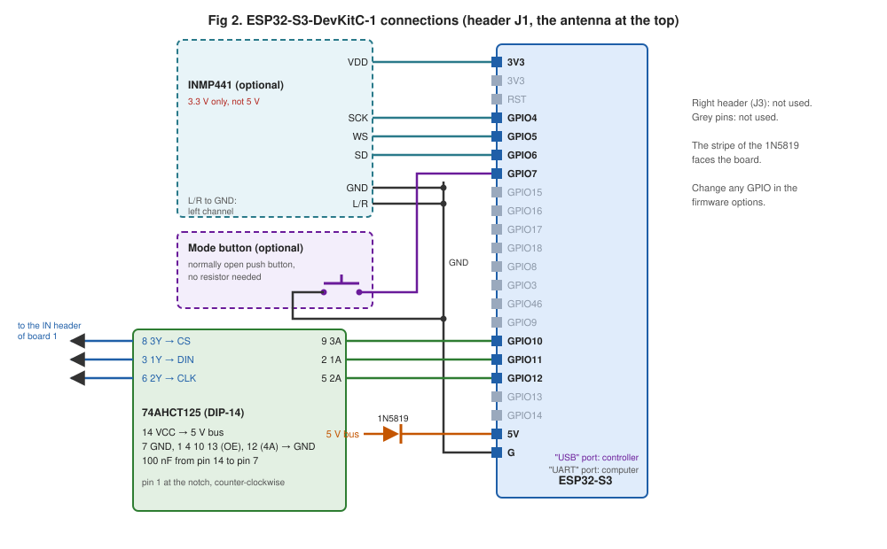
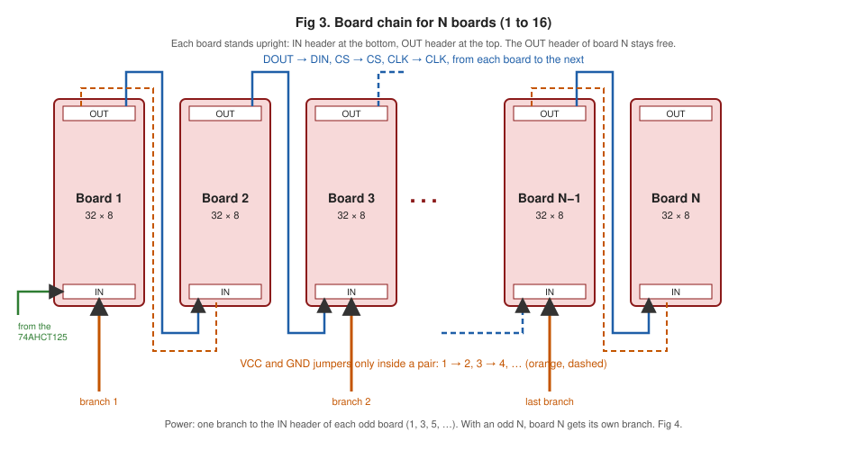
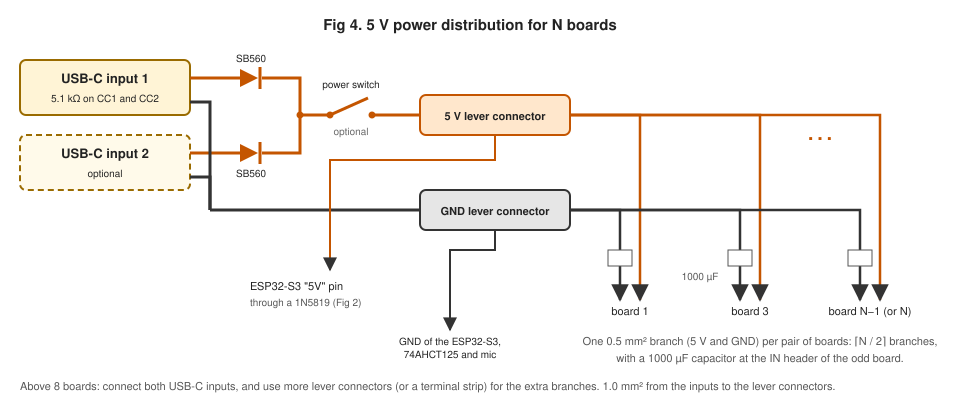

# Power and Wiring

This document tells you how to connect the parts of a Life Torus: the signal chain from the ESP32-S3 to the LED boards, the USB controller, the USB-C power inputs and the 5 V power distribution. It also tells you how much current the display uses, and which power bank or charger is enough. The [Bill of Materials](bill-of-materials.md) lists the parts. The [Assembly Guide](../assembly/README.md) tells you in which order to build the ring.

The diagrams work for any number of boards, N, from 1 to 16. The default is 8. Set N in the firmware options or in the phone app. Refer to [Firmware Configuration](../software/configuration.md).

Fig 1. Overview. The other figures show each part in detail.

## ESP32-S3 Connections

All connections to the ESP32-S3-DevKitC-1 are on its left header (J1): the level shifter, the microphone, the mode button and the 5 V feed. The controller uses the "USB" port at the bottom of the board.

Fig 2. ESP32-S3 connections. Grey pins are not used.

The next three sections list the same connections as tables.

## Signal Chain

The MAX7219 chips of all boards (4 on each board) are one daisy chain. The ESP32-S3 sends the data into board 1. Each board passes the data to the next board through its output header. The ESP32-S3 uses 3.3 V logic. The MAX7219 needs a 5 V logic level, so a 74AHCT125 buffer changes the signals to 5 V.

| ESP32-S3 pin | 74AHCT125 input | 74AHCT125 output | Board 1 IN header |
| ------------ | --------------- | ---------------- | ----------------- |
| `GPIO11`     | 1A (pin 2)      | 1Y (pin 3)       | `DIN`             |
| `GPIO12`     | 2A (pin 5)      | 2Y (pin 6)       | `CLK`             |
| `GPIO10`     | 3A (pin 9)      | 3Y (pin 8)       | `CS`              |

Connect the other pins of the 74AHCT125 like this:

- pin 14 (VCC) to the 5 V bus
- pin 7 (GND) to the GND bus and to a `G` pin of the ESP32-S3
- pins 1, 4, 10 and 13 (the output enables, active low) to GND
- pin 12 (4A, not used) to GND
- a 100 nF capacitor from pin 14 to pin 7, as near to the chip as possible

The GPIO numbers are the firmware defaults. You can change them in the firmware options. Refer to [Firmware Configuration](../software/configuration.md).

## Microphone

The INMP441 microphone is optional. With it, the display modes (not Game of Life) move with the beat of music. Refer to [Phone Control](../software/phone-control.md). Connect it to the ESP32-S3 board with short wires:

| INMP441 pin | ESP32-S3 pin |
| ----------- | ------------ |
| `VDD`       | `3V3`        |
| `GND`       | `G`          |
| `SCK`       | `GPIO4`      |
| `WS`        | `GPIO5`      |
| `SD`        | `GPIO6`      |
| `L/R`       | `G`          |

The microphone takes 3.3 V, not 5 V. Mount it where the sound can reach it, for example behind a small hole in the base, and away from the 5 V power wires. The firmware finds it at start-up. With no microphone, the data line stays low and the firmware turns beat sync off.

## Mode Button

The mode button is optional. It moves to the next display mode at each press: Game of Life, scrolling text, rain, barber pole, ripples, sparkle, visualiser, then Game of Life again. Connect a normally open push button from `GPIO7` to a `G` pin of the ESP32-S3 board. The firmware uses the internal pull-up of the GPIO and removes the contact bounce, so you need no resistor or capacitor. You can change the GPIO in the firmware options. With no button, the firmware sees the GPIO always high, so nothing happens. The phone app can still change the display mode.

## Board to Board

Fig 3. Board chain for N boards.

Each board stands upright in the ring, with its IN header at the bottom and its OUT header at the top. Connect the OUT header of each board to the IN header of the next board with female-to-female jumper wires:

- `DOUT` to `DIN`
- `CLK` to `CLK`
- `CS` to `CS`
- `VCC` to `VCC` and `GND` to `GND`, only inside each pair of boards: 1 to 2, 3 to 4, 5 to 6, and so on

With an odd number of boards, the last board has no pair. It gets its own power branch. The OUT header of the last board stays free.

The jumper from the top of one board to the bottom of the next board is approximately 15 cm long. If you mount every second board upside down, the jumpers are much shorter. Then set the zigzag option in the firmware. The bring-up firmware finds the correct layout options. Refer to [Display Bring-Up](bring-up.md).

Keep the `CLK` and `CS` wires away from the 5 V power wires where possible. If cells flicker at random, reduce the SPI clock option.

## Controller

Connect the USB controller to the "USB" port of the ESP32-S3 board, through a USB OTG adapter. Do not use the "UART" port for the controller. The "UART" port is for flashing and for the log.

The ESP32-S3-DevKitC-1 does not always supply 5 V to a device on its "USB" port. If the controller does not start, use a powered USB OTG adapter, or a USB OTG Y-cable with its power lead on the 5 V bus. The bring-up checklist confirms which method works.

## USB-C Power Input

A USB-C power bank or a USB-C wall charger powers the display, at 5 V. The display has one or two USB-C power inputs. Each input is a USB-C socket breakout for power:

- The breakout must have a 5.1 kΩ resistor from CC1 to GND and one from CC2 to GND. These resistors tell the power bank or charger that a device is connected. Without them, most USB-C sources do not turn on their 5 V output.
- With these resistors, a USB-C source supplies 5 V only. It never changes to 9 V or more. Do not use a USB-C "PD trigger" board: the LED boards and the ESP32-S3 board take 5 V only.
- Use a USB-C to USB-C cable that is rated for 3 A. A USB-A to USB-C cable usually supplies less current.

Connect each input to the 5 V lever connector through its own SB560 Schottky diode, with the stripe (cathode) towards the lever connector. Connect the GND of each input to the GND lever connector. The diodes stop one source from feeding current into the other when both inputs are connected. They also drop approximately 0.4 V, so the bus is at approximately 4.6 V. The MAX7219 and the 74AHCT125 work from 4.0 V to 5.5 V.

| Inputs connected | Current available | Use                                     |
| ---------------- | ----------------- | --------------------------------------- |
| one, 5 V 3 A     | approximately 3 A | default brightness (intensity 4)        |
| two, 5 V 3 A     | approximately 6 A | higher intensity, up to approximately 8 |

With two inputs, the source with the higher voltage supplies most of the current. When it reaches its limit, its voltage drops and the other source supplies the rest. You can use two ports of one power bank, or a power bank and a charger.

Some power banks turn off when the current is very low. The display always uses at least approximately 0.3 A, so a power bank stays on.

## Power Switch

The power switch is optional. It turns the whole Life Torus on and off: the LED boards, the ESP32-S3 and the microphone. Put it in the 5 V wire after the two SB560 diodes, between the point where the two inputs join and the 5 V lever connector. Leave the GND wire without a switch.

Use a switch rated for at least 10 A, so it stays cool with two 3 A inputs. A switch rated for mains voltage (for example 10 A, 250 V AC) is good for 5 V DC too.

With no power switch, connect the joined diodes straight to the 5 V lever connector. Then the USB-C cable is the on and off switch.

Some power banks turn off by themselves when nothing draws current. After a long time with the switch off, you can have to press the button on the power bank before the display starts again.

## Power Distribution

Fig 4. 5 V power distribution for N boards.

The USB-C inputs feed two lever connectors: one for 5 V and one for GND. Use 1.0 mm² wire from the inputs to the lever connectors. From the lever connectors, one branch of 0.5 mm² wire goes to the IN header of each odd board: 1, 3, 5, and so on. That is N / 2 branches, rounded up: 4 branches for 8 boards. The jumper wires carry the power on to the even boards. Put a 1000 µF capacitor across 5 V and GND at each injection point, with the correct polarity. A 5-way lever connector has room for the input and 4 branches. For more boards, use a second lever connector of each kind, or a terminal strip.

Do not feed all the boards through the board-to-board jumpers. The jumpers and the header pins are not made for the current of the full display.

Connect the `5V` pin of the ESP32-S3 board to the 5 V bus through a 1N5819 Schottky diode (stripe towards the board), and a `G` pin to the GND bus. The diode stops the USB supply of your computer from feeding the display when you connect the "UART" port. The board docs say that you must not power the board from two sources at the same time.

## Power Sizing

The values are for 8 boards. The current of the LEDs scales with the number of boards: for 4 boards, half the values; for 16 boards, two times the values. With more than 8 boards, use two USB-C inputs, and add one power branch for each extra pair of boards.

Each MAX7219 multiplexes its 64 LEDs: only one row of 8 LEDs is on at a time. The current depends on the number of lit LEDs and on the intensity setting. These values are estimates from the MAX7219 datasheet, with the typical segment current of these boards (approximately 40 mA):

| Display state                   | Intensity 4 (default) | Intensity 8         | Intensity 15 (maximum) |
| ------------------------------- | --------------------- | ------------------- | ---------------------- |
| all 2,048 LEDs on               | approximately 3 A     | approximately 5.5 A | approximately 10.5 A   |
| a typical Life board (25 % lit) | approximately 1 A     | approximately 1.6 A | approximately 3 A      |
| all LEDs off                    | approximately 0.3 A   | approximately 0.3 A | approximately 0.3 A    |

The Wi-Fi of the phone app adds approximately 100 mA to each value.

A Life board is rarely more than 30 % lit, so one 3 A input is enough at the default intensity. The "all on" test pattern of the bring-up firmware is the worst case. At intensity 4 it uses the full 3 A of one input, so test it with two inputs, or keep the test short. If a source reaches its limit, its voltage drops and the display flickers or the ESP32-S3 restarts. Then lower the intensity or connect the second input.

At 5 V 1 A, a 10,000 mAh power bank (approximately 37 Wh) runs the display for approximately 6 hours. The bring-up checklist measures the real current. Its results replace these estimates.

## Safety

Everything in the build is at 5 V, so there is no mains voltage to touch. The current can still be high:

- Use wire of the size in this document. A thin wire can get hot.
- Make sure that the 5 V and GND wires cannot touch each other. A short circuit can make a power bank or a wire very hot. Most USB-C sources turn off at a short circuit, but do not trust this.
- Check the polarity of the diodes and the bulk capacitors before you connect power. A reversed electrolytic capacitor can burst.

## See Also

- [Bill of Materials](bill-of-materials.md): parts, suppliers and prices.
- [Assembly Guide](../assembly/README.md): build the ring step by step.
- [Display Bring-Up](bring-up.md): test patterns and checks for a new display.
