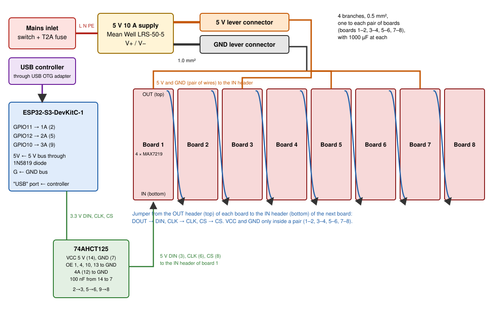

# Power and Wiring

This document tells you how to connect the parts of a Life Torus: the signal chain from the ESP32-S3 to the eight LED boards, the USB controller, and the 5 V power distribution. It also tells you how to size the power supply and how to do the mains side safely. The [Bill of Materials](bill-of-materials.md) lists the parts. The [Assembly Guide](../assembly/README.md) tells you in which order to build the ring.

Fig 1. Signal chain, controller and 5 V power.

## Signal Chain

The 32 MAX7219 chips of the eight boards are one daisy chain. The ESP32-S3 sends the data into board 1. Each board passes the data to the next board through its output header. The ESP32-S3 uses 3.3 V logic. The MAX7219 needs a 5 V logic level, so a 74AHCT125 buffer changes the signals to 5 V.

| ESP32-S3 pin | 74AHCT125 input | 74AHCT125 output | Board 1 IN header |
| ------------ | --------------- | ---------------- | ----------------- |
| `GPIO11`     | 1A (pin 2)      | 1Y (pin 3)       | `DIN`             |
| `GPIO12`     | 2A (pin 5)      | 2Y (pin 6)       | `CLK`             |
| `GPIO10`     | 3A (pin 9)      | 3Y (pin 8)       | `CS`              |

Connect the other pins of the 74AHCT125 like this:

- pin 14 (VCC) to the 5 V bus
- pin 7 (GND) to the GND bus and to a `G` pin of the ESP32-S3
- pins 1, 4, 10 and 13 (the output enables, active low) to GND
- pin 12 (4A, not used) to GND
- a 100 nF capacitor from pin 14 to pin 7, as near to the chip as possible

The GPIO numbers are the firmware defaults. You can change them in the firmware options. Refer to [Firmware Configuration](../software/configuration.md).

## Board to Board

Each board stands upright in the ring, with its IN header at the bottom and its OUT header at the top. Connect the OUT header of each board to the IN header of the next board with female-to-female jumper wires:

- `DOUT` to `DIN`
- `CLK` to `CLK`
- `CS` to `CS`
- `VCC` to `VCC` and `GND` to `GND`, only from board 1 to 2, 3 to 4, 5 to 6 and 7 to 8

The jumper from the top of one board to the bottom of the next board is approximately 15 cm long. If you mount every second board upside down, the jumpers are much shorter. Then set the zigzag option in the firmware. The bring-up firmware finds the correct layout options. Refer to [Display Bring-Up](bring-up.md).

Keep the `CLK` and `CS` wires away from the 5 V power wires where possible. If cells flicker at random, reduce the SPI clock option.

## Controller

Connect the USB controller to the "USB" port of the ESP32-S3 board, through a USB OTG adapter. Do not use the "UART" port for the controller. The "UART" port is for flashing and for the log.

The ESP32-S3-DevKitC-1 does not always supply 5 V to a device on its "USB" port. If the controller does not start, use a powered USB OTG adapter, or a USB OTG Y-cable with its power lead on the 5 V bus. The bring-up checklist confirms which method works.

## Power Distribution

The 5 V supply feeds two lever connectors: one for 5 V and one for GND. Use 1.0 mm² wire from the supply to the lever connectors. From the lever connectors, four branches of 0.5 mm² wire go to the IN headers of boards 1, 3, 5 and 7. The jumper wires carry the power on to boards 2, 4, 6 and 8. Put a 1000 µF capacitor across 5 V and GND at each of the four injection points, with the correct polarity.

Do not feed all eight boards through the board-to-board jumpers. The jumpers and the header pins are not made for the current of the full display.

Connect the `5V` pin of the ESP32-S3 board to the 5 V bus through a 1N5819 Schottky diode (stripe towards the board), and a `G` pin to the GND bus. The diode stops the USB supply of your computer from feeding the display when you connect the "UART" port. The board docs say that you must not power the board from two sources at the same time.

## Power Sizing

Each MAX7219 multiplexes its 64 LEDs: only one row of 8 LEDs is on at a time. The current depends on the number of lit LEDs and on the intensity setting. These values are estimates from the MAX7219 datasheet, with the typical segment current of these boards (approximately 40 mA):

| Display state                   | Intensity 4 (default) | Intensity 15 (maximum) |
| ------------------------------- | --------------------- | ---------------------- |
| all 2,048 LEDs on               | approximately 3 A     | approximately 10.5 A   |
| a typical Life board (25 % lit) | approximately 1 A     | approximately 3 A      |
| all LEDs off                    | approximately 0.3 A   | approximately 0.3 A    |

The firmware limits the intensity to 4 by default, so a 5 V 10 A supply has a large margin. At intensity 15 with all LEDs on, the display can reach the limit of the supply. The supply then limits the current, and the display goes dark or flickers. The bring-up checklist measures the real current. Its results replace these estimates.

## Mains Safety

**Warning:** the power supply connects to mains voltage, which can kill. Keep all mains parts inside an enclosure that a person cannot open without a tool.

- Use an enclosed, certified power supply, for example the Mean Well LRS-50-5. Do not use an open-frame supply.
- Feed mains through an IEC inlet with a switch and a T2A fuse.
- Connect the protective earth (PE) to the earth terminal of the supply.
- Close the terminal cover of the supply.
- Use strain relief for the mains cable and for the 5 V wires where they leave the enclosure.
- Disconnect the mains cable before you touch the wiring.

If you do not have experience with mains wiring, ask a qualified person to do the mains side. Everything outside the enclosure is at 5 V.

## See Also

- [Bill of Materials](bill-of-materials.md): parts, suppliers and prices.
- [Assembly Guide](../assembly/README.md): build the ring step by step.
- [Display Bring-Up](bring-up.md): test patterns and checks for a new display.
